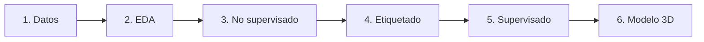

# Capítulo III. Metodología

!!! abstract "En esta página"
    Seis etapas: datos → EDA → no supervisado → **etiquetado del geólogo** →
    supervisado → modelo 3D. El paso 4 no se salta; está desarrollado en
    [asignación de dominios](03-asignacion-dominios.md).

El diseño es cuantitativo, correlacional y aplicado: se busca predecir el
**dominio geológico de alteración** a partir de espectro y química de sondaje.

## 3.1 Flujo en seis etapas

1. **Recolección.** Espectros TerraSpec y ensayos multielementales, validados
   y unidos por muestra / from–to.
2. **EDA.** Variables categóricas (`aiMineral1`, `VNIRMinerals`) y numéricas
   (13 scores SWIR).
3. **No supervisado.** PCA, dendrograma y K-Means (k = 5) **sobre espectro**.
4. **Segmentación (crítica).** El geólogo valida clústeres y define `MOD_ALT`.
   El algoritmo propone; **no etiqueta solo**. Ver
   [Asignación de dominios](03-asignacion-dominios.md).
5. **Supervisado.** 80 % / 20 % estratificado sobre tramos etiquetados;
   comparación RF, k-NN, MLP y SVM **sobre geoquímica**.
6. **Predicción 3D.** El mejor modelo etiqueta el resto de intervalos.

En la tesis el modelado se hizo en **Orange** (lienzo de widgets, sin escribir
código). Este repositorio reproduce las mismas etapas en scikit-learn, y las
deja también en [Google Colab](09-orange-colab.md) para quien no instala
Python.

## 3.2 Datos espectrales

Ausspec entrega ~69 columnas. Tras tirar minerales de media cero quedan
**13 scores SWIR** (Tabla 15):

WhiteMica, Chlorite, Carbonate, Epidote, Kaolinite, Dickite, Montmor,
Alunite, Gypsum, Pyrophyllite, Diaspore, Zunyite, Water_silica.

VNIR aporta hematita/goethita para el dominio de óxidos. Pares con Pearson y
Spearman > 0,65 se leyeron como ensamble.

## 3.3 Datos químicos

Protocolo (sección 3.10):

1. Completitud ≥ **80 %** (se eliminaron variables raras: AuCN, CuCN, Hg, etc.).
2. Imputación: **mediana por sondaje**, luego mediana global.
3. Outliers: recorte al **percentil 99** (no se borran filas).
4. **Z-score**, porque conviven `%` y `ppm`.

La variable objetivo es `MOD_ALT`. Las coordenadas **no** entran al
clasificador (evitar fuga espacial).

## 3.4 Asignación de dominios (algoritmo + geólogo)

Esta etapa corre **a la par del juicio geológico**. PCA y K-Means ordenan la
nube espectral; el dominio (`MOD_ALT`) se firma cuando el ensamble mineral
cuadra con el logueo y con la continuidad 3D. Un clúster puede partirse en
dos dominios, o dos clústeres fusionarse (p. ej. ArgAvd y ArgAvd_2).

La guía ilustrada está en
[Asignación de dominios](03-asignacion-dominios.md).

| Código | Dominio | Criterio mineralógico |
| --- | --- | --- |
| ArgAvd | Argílica avanzada | Pirofilita + alunita (± diásporo, zunyita). Se fusionan dos variantes ácidas |
| Fil | Fílica | Mica blanca dominante |
| Arg | Argílica | Caolinita + mica blanca |
| Pro | Propilítica | Montmorillonita + clorita ± carbonato/epidota |
| Sk | Skarn | Clorita + montmorillonita + mica + caolinita |
| Oxd | Óxidos | Hematita/goethita VNIR ± yeso/sílice hidratada |

En la tesis, 86 538 intervalos etiquetados (Tabla 17): Fil 28 669, Sk 25 266,
ArgAvd 23 308, Pro 5 050, Oxd 3 297, Arg 978. Fil, Sk y ArgAvd dominan; Arg y
Pro son clases raras (sesgo de recall).

## 3.5 Hiperparámetros publicados (Tablas 19–22)

| Modelo | Ajuste |
| --- | --- |
| Random Forest | 10 árboles, `max_features=8`, profundidad 4, `min_samples_split=5`, clases balanceadas |
| k-NN | k = 5, Euclidean, pesos por distancia |
| MLP | 100 neuronas, ReLU, Adam, α = 10⁻⁴, 200 iteraciones |
| SVM | C = 1, kernel RBF, tope de **100 iteraciones** en Orange |

El tope de 100 iteraciones del SVM explica, en parte, su mal desempeño. El
perfil `robust` del código relaja árboles, red e iteraciones.

## 3.6 División train / test

Tramos validados en 3D: 86 538. De ellos, 80 % (69 231) calibran; el resto de
la química (≈ 147 820) se usó como población más ciega. Una partición
puramente aleatoria por fila inflaría métricas por correlación espacial a lo
largo del mismo taladro.

**Siguiente (el paso decisivo):**
[El geólogo asigna los dominios](03-asignacion-dominios.md).

