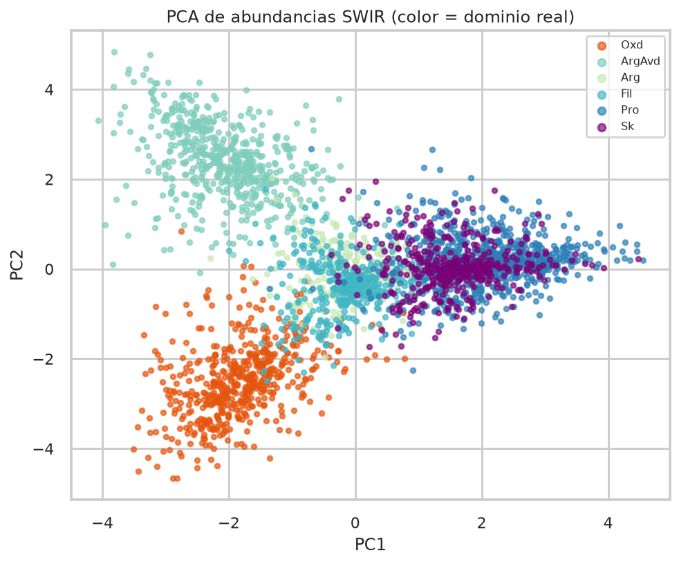
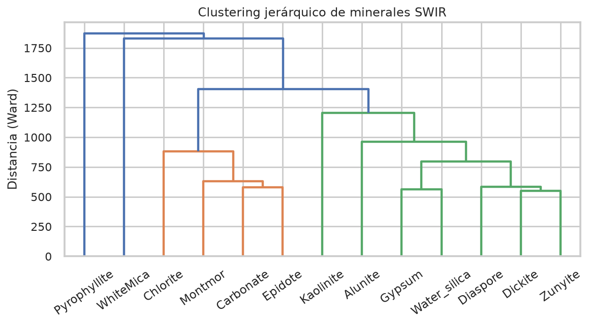
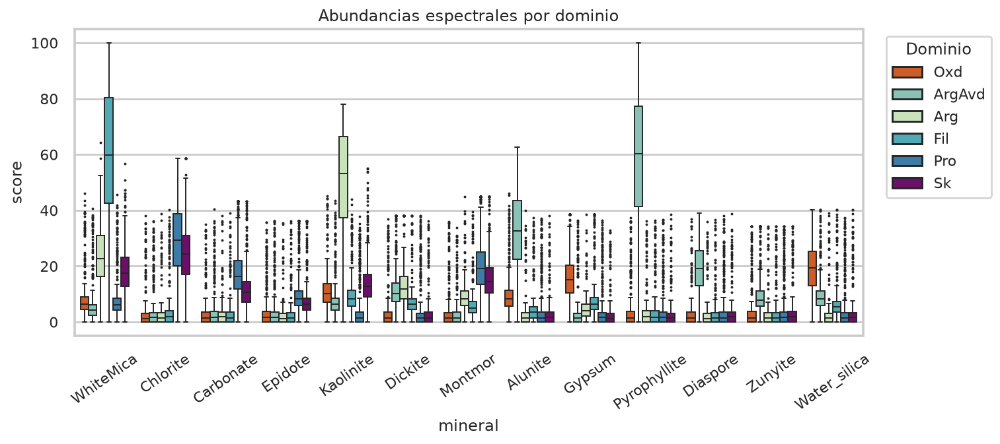

# Capítulo IV. Espectro, geoquímica y ensambles

## 4.1 Lectura de variables categóricas

`aiMineral1` (mineral SWIR más abundante) y `VNIRMinerals` (óxidos) mostraron
contraste usable en sección: pirofilita–alunita, caolinita–micas, clorita–
carbonato, y goethita/hematita. La columna de *mezclas* (`SWIRMin_nowt`, hasta
seis fases) no armó dominios modelables: demasiadas combinaciones, poca
relación con el logueo. Se descartó como feature directa.

## 4.2 Trece minerales y su geología

**Argílica avanzada (alta sulfuración):** alunita, pirofilita, dickita,
caolinita, diásporo. Núcleo ácido, SO₂, a veces alta temperatura (diásporo).

**Argílica intermedia y fílica:** mica blanca, dickita, caolinita,
montmorillonita. Halo alrededor del núcleo; montmorillonita sugiere
neutralización o mezcla meteórica.

**Propilítica:** clorita, carbonato, epidota; periferia más neutra y fría.
Goethita/hematita marcan oxidación somera, no el halo propilítico profundo.

Correlaciones: clorita–carbonato (Pearson) y clorita–montmorillonita
(Spearman) positivas; mica blanca vs alunita/pirofilita, asociación negativa
moderada — coherente con núcleo ácido vs halo fílico.

## 4.3 PCA y dendrograma (k = 5)

El PCA de los 13 scores separa ensambles. Interpretación de clústeres de
minerales (sección 4.2):

| Clúster | Minerales | Lectura |
| --- | --- | --- |
| C1 | Pirofilita | Ácido, a veces solo |
| C2 | Alunita, zunyita, diásporo | Argílica avanzada |
| C3 | Epidota, montmorillonita, clorita, carbonato | Propilítica |
| C4 | Caolinita, dickita | Argílica intermedia |
| C5 | Yeso, mica blanca, sílice hidratada | Fílica / baja T |

K-Means (k = 5) se corre **sobre muestras**. No coincide 1:1 con los seis
`MOD_ALT`: skarn y propilítica comparten clorita; los óxidos viven sobre todo
en VNIR. El etiquetado final mezcla clúster + ensamble + validación 3D.

Las figuras de esta página salen del depósito **sintético** del código, no de
la unidad original. Reproducen la lógica de ensambles.

## 4.4 Geoquímica que arrastra la zonación

Firmas típicas usadas para el clasificador supervisado:

| Dominio | Firma química |
| --- | --- |
| ArgAvd | Au–As–S altos, Ca–Na bajos |
| Fil | K–Rb–Ba, S moderado |
| Arg | Al alto, metales bajos |
| Pro | Ca–Mg–Fe–Mn, Au bajo |
| Sk | Ca–Fe–Mn–Cu–W |
| Oxd | Fe–As altos, S muy bajo |

