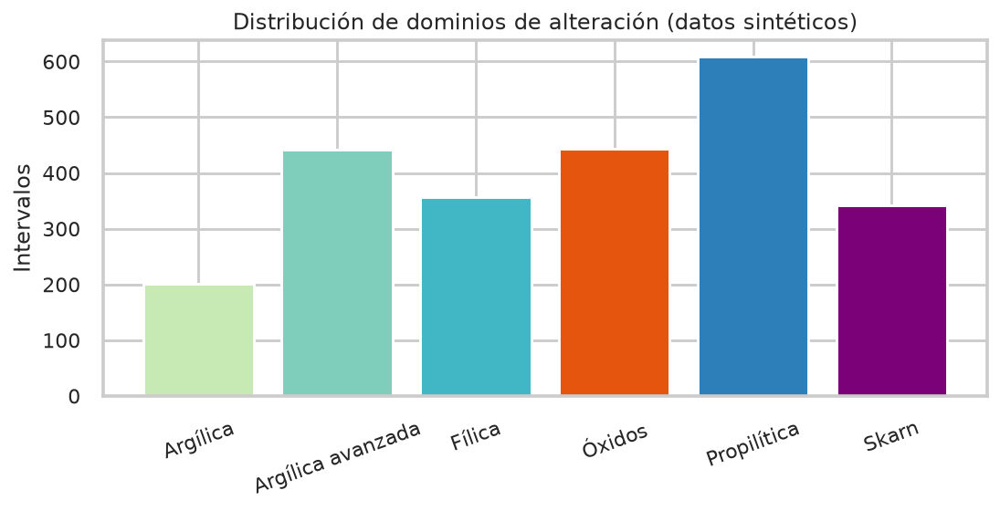

# 3. Espectrometría y geoquímica

## Rasgos SWIR que importan

Longitudes diagnósticas (Pontual, 2013; Tabla 6–7 de la tesis):

| Enlace | nm | Minerales típicos |
| --- | --- | --- |
| Al–OH | 2160–2220 | alunita, pirofilita, caolinita, ilita |
| Fe–OH | 2230–2295 | clorita férrica |
| Mg–OH / CO₃ | 2300–2360 | clorita, carbonato, epidota |
| OH / H₂O | ~1400, ~1900 | micas, caolinita, sílice hidratada |

El pipeline **no reinterpreta espectros ASD**: trabaja con scores 0–100, como
la matriz Ausspec. `synthetic_swir_curve()` solo dibuja un valle gaussiano
didáctico a partir de esos scores.

## Trece minerales retenidos

Tras eliminar fases de media cero (ruido o trazas), la tesis conserva:

WhiteMica, Chlorite, Carbonate, Epidote, Kaolinite, Dickite, Montmor,
Alunite, Gypsum, Pyrophyllite, Diaspore, Zunyite, Water_silica.

En el sintético, esas medias se muestrean con ruido para que ArgAvd no sea
un punto perfecto de pirofilita, ni Fil una mica pura.

## Lectura geológica de los ensambles

- **Argílica avanzada.** Fluidos ácidos; pirofilita + alunita ± diásporo/zunyita.
- **Fílica.** Halo de mica blanca; transiciones a caolinita/dickita.
- **Argílica.** Caolinita + mica; menor temperatura o mayor mezcla meteórica.
- **Propilítica.** Clorita–carbonato–epidota en la periferia más neutra.
- **Skarn.** Mismo family de filosilicatos con geoquímica cálcica-férrea.
- **Óxidos.** VNIR (hematita/goethita) cerca de superficie; S bajo.

## Geoquímica

34 columnas tras el filtro de completitud. Firmas esperadas (y programadas
en el generador):

| Dominio | Firma química típica |
| --- | --- |
| ArgAvd | Au–As–S altos, Ca–Na bajos |
| Fil | K–Rb–Ba, S moderado |
| Arg | Al alto, metales bajos |
| Pro | Ca–Mg–Fe–Mn, Au bajo |
| Sk | Ca–Fe–Mn–Cu–W |
| Oxd | Fe–As altos, S muy bajo |

El desbalance (pocos intervalos Arg y Pro) es intencional: replica el sesgo
de la Tabla 17 y explica parte del sobreajuste discutido en la tesis.
