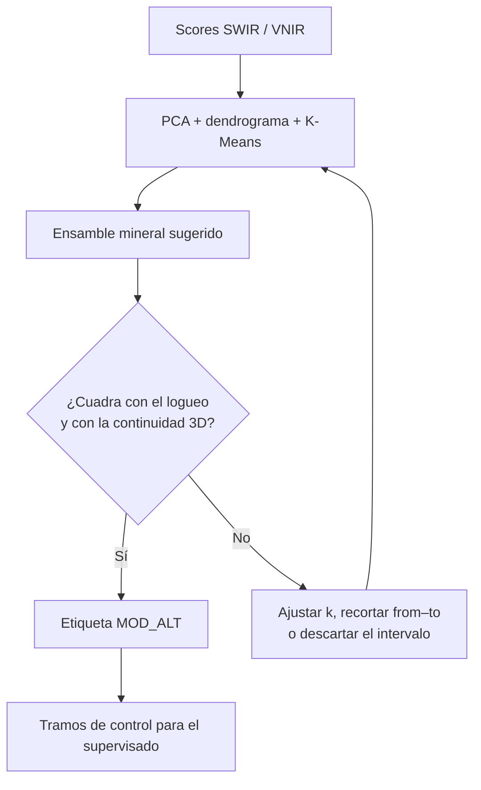
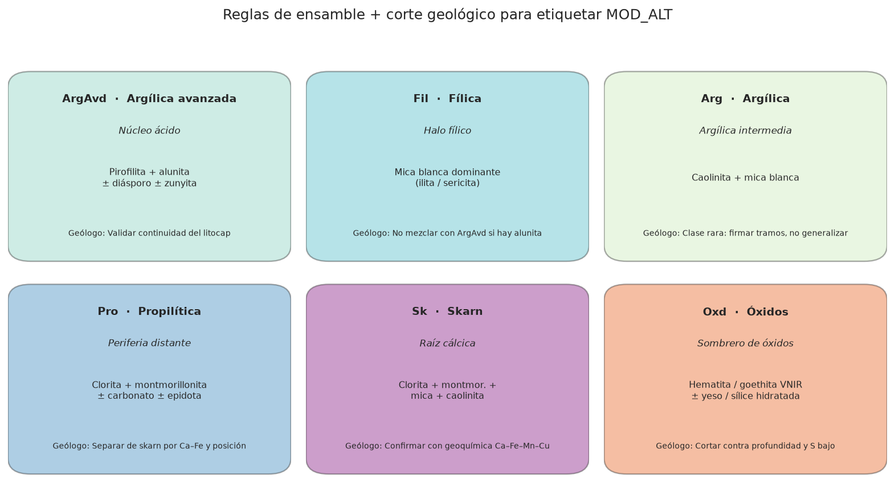
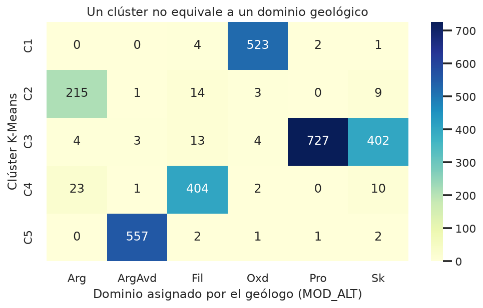
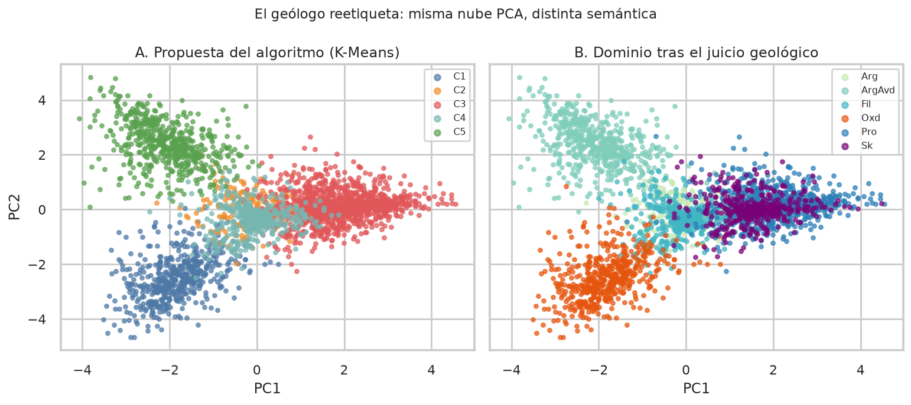
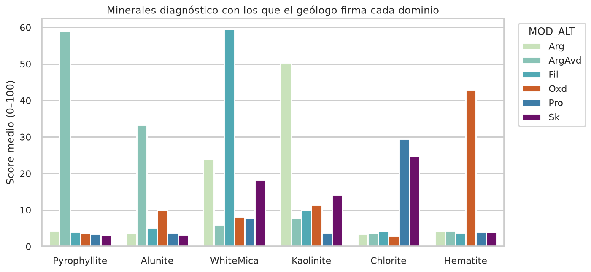
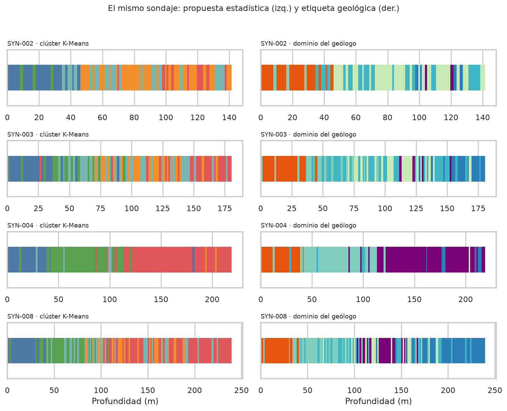

# Asignación de dominios (algoritmo + geólogo)

Esta es la etapa que **no se automatiza del todo**. El clustering propone
grupos; el geólogo los convierte en dominios geológicos (`MOD_ALT`). En la
tesis (sección 3.12.2 y Figuras 24–27) esa firma se hizo en sección 3D,
cruzando scores SWIR, clústeres y el logueo.

!!! important "El ML no reemplaza el logueo"
    K-Means con k = 5 **no** es el modelo de alteración. Un mismo clúster
    puede ser fílico en un tramo y argílico avanzado en otro. El dominio
    nace cuando el geólogo acepta, recorta o descarta intervalos.

## El ciclo de trabajo

El algoritmo propone grupos; el geólogo acepta, recorta o descarta. Solo entonces existe <code>MOD_ALT</code>.

1. Se calculan clústeres **sin etiqueta**.
2. Se interpretan con minerales diagnóstico (pirofilita–alunita, mica blanca,
   clorita, hematita, etc.).
3. El geólogo mira la **continuidad entre sondajes**: un intervalo aislado
   no abre un dominio.
4. Solo los tramos firmados entran al entrenamiento del Random Forest.

## Reglas de ensamble (propuesta) y corte geológico

Las reglas salen de la tesis; el corte es humano. ArgAvd_2 (alunita mayor que
pirofilita) se **fusionó** con ArgAvd porque no se sostenían como sólidos
separados.

| Código | Lo que propone el espectro | Lo que mira el geólogo |
| --- | --- | --- |
| ArgAvd | Pirofilita + alunita ± diásporo/zunyita | Continuidad del núcleo ácido; no “pintar” halos |
| Fil | Mica blanca dominante | Halo alrededor de ArgAvd; alunita residual ≠ ArgAvd |
| Arg | Caolinita + mica | Poco volumen: firmar tramos, no extrapolar |
| Pro | Clorita + montmorillonita ± carbonato | Distal; no confundir con skarn |
| Sk | Clorita + montmor. + mica + caolinita | Posición profunda y firma Ca–Fe–Mn–Cu |
| Oxd | Hematita/goethita VNIR | Superficie y azufre bajo |

## Por qué el clúster no es el dominio

La matriz cuenta cuántos intervalos de cada K-Means acabaron en cada
`MOD_ALT`. Si una fila se reparte en varias columnas, **ahí estuvo el juicio**:
el algoritmo mezcló dos ensambles y el geólogo los separó.

## Minerales con los que se firma

Antes de aceptar un tramo, se mira si el score diagnóstico es coherente.
ArgAvd debe cargar pirofilita/alunita; Fil, mica blanca; Pro/Sk, clorita;
Oxd, hematita.

## En el sondaje (análogo a las Figuras 24–26)

A la izquierda, la tira que sale de K-Means. A la derecha, la tira después
de recortar y fusionar con criterio geológico. Los contactos que “saltan”
entre taladros se corrigen en esta etapa; no en el Random Forest.

Misma malla, dos columnas: clúster (izquierda) frente al dominio firmado (derecha). Los saltos entre taladros se corrigen aquí, no en el Random Forest.

## Qué pasa después

Los intervalos con `MOD_ALT` firmado son la variable objetivo del
aprendizaje supervisado. La geoquímica **no** define el dominio en esta
fase: lo predice más tarde, cuando ya no hay TerraSpec.

Si el sólido 3D (Leapfrog u otro) no cierra, se vuelve al paso 2: no se
baja la calidad del etiquetado para “subir el accuracy”.

**Siguiente:** [Espectro y geoquímica](03-analisis-espectral.md) o, si quieres
el ranking de algoritmos, [resultados de ML](04-modelamiento-ml.md).

