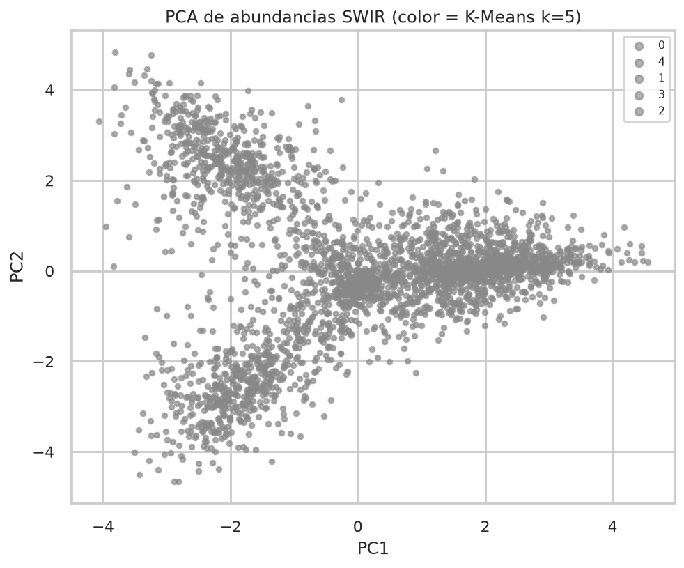
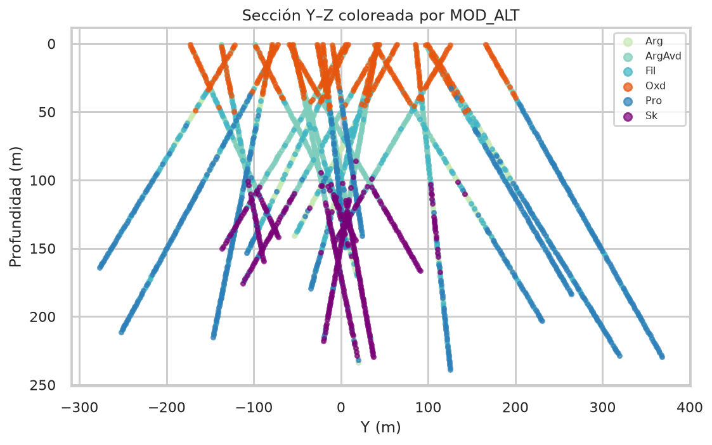
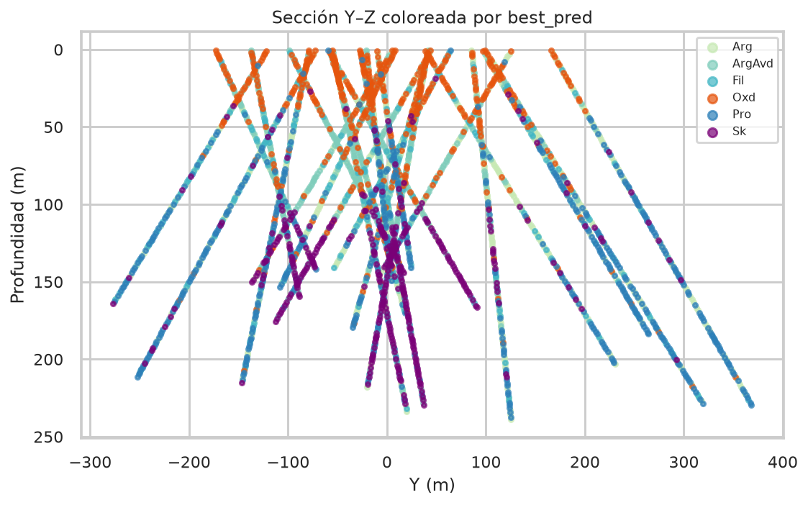

# 4. Machine learning y resultados en el sintético

Los números de esta página salen de `python -m alteration_ml.cli run --profile thesis`
sobre el CSV de semilla 42 (~2 900 intervalos). No son las métricas de un
yacimiento real: el sintético mete ruido, sesgo por sondaje y 28 % de mezcla
con dominios vecinos para que el problema no sea trivial.

Ranking típico con el perfil publicado (RF poco profundo, SVM a 100 iteraciones):

| Modelo | AUC | accuracy | F1 macro |
| --- | --- | --- | --- |
| random_forest | 0.86 | 0.62 | 0.60 |
| neural_network | 0.81 | 0.55 | 0.51 |
| knn | 0.77 | 0.52 | 0.49 |
| svm | 0.80 | 0.20 | 0.17 |

Random Forest gana, y SVM queda último — el mismo orden cualitativo de la tesis,
aunque los valores absolutos cambian porque el dato no es el de operación.

## Espacio PCA

Los dos primeros componentes suelen concentrar la mayor parte de la varianza
de los 13 scores. El núcleo ácido (pirofilita–alunita) se separa del halo de
mica y del extremo clorita–carbonato.

## Dendrograma y K-Means

El clustering jerárquico se calcula **entre minerales**. Agrupaciones esperadas:

- Pirofilita (a veces sola)
- Alunita + diásporo + zunyita
- Caolinita + dickita
- Clorita + carbonato + epidota + montmorillonita
- Mica blanca + yeso + sílice hidratada

K-Means (`k=5`) se calcula **entre muestras**. No tiene por qué coincidir 1:1
con los seis `MOD_ALT` (el skarn y la propilítica comparten clorita; los óxidos
se apoyan en VNIR).

## Clasificación supervisada

Los cuatro modelos ven **solo geoquímica**. Eso obliga a que la química
arrastre la zonación espectral, que es el punto del método: predecir alteración
donde no hay TerraSpec.

En la tesis, Random Forest alcanzó AUC/precisión cercanas a 1 en validación
interna y ~0.73–0.78 en un conjunto más ciego, con SVM muy por debajo. El
sintético es más separable, así que las cifras absolutas cambian; el ranking
sigue siendo el resultado a discutir.

## Continuidad espacial

La planta y la sección no se usan como features. Sirven para verificar que
la predicción no rompe la zonación (núcleo, halo, distal, profundo, somero).

## Limitaciones que el código no esconde

- Scores minerales ya interpretados (Ausspec); el error de mezcla espectral
  se hereda.
- SWIR no ve cuarzo, sulfuros ni feldespato: la potásica queda ciega.
- Clases raras (Arg, Pro) degradan el recall.
- Coordenadas excluidas a propósito; un modelo espacial explícito sería otro
  experimento (y otra fuga potencial).
