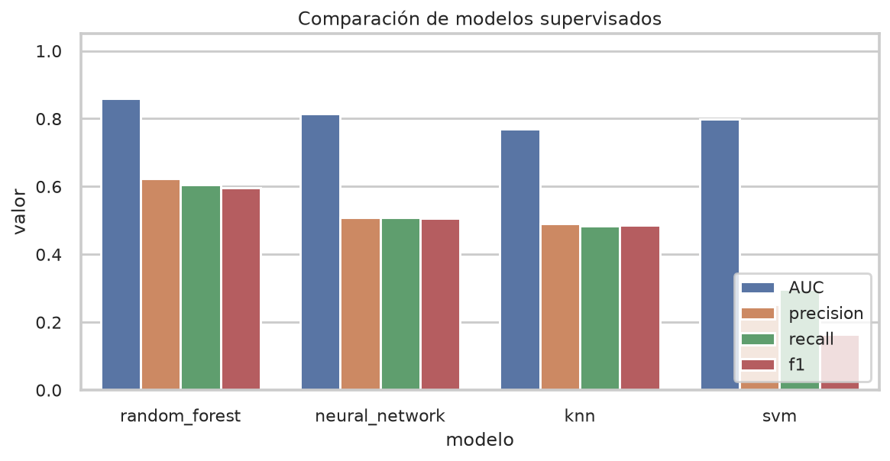
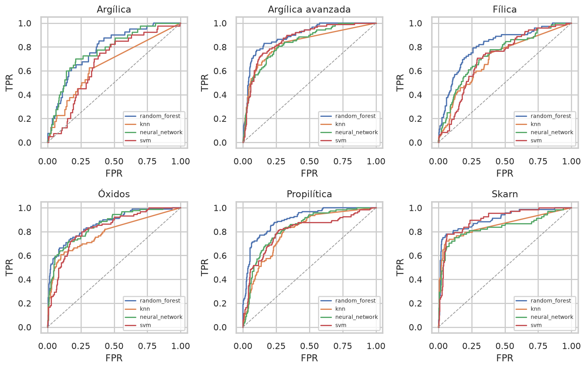
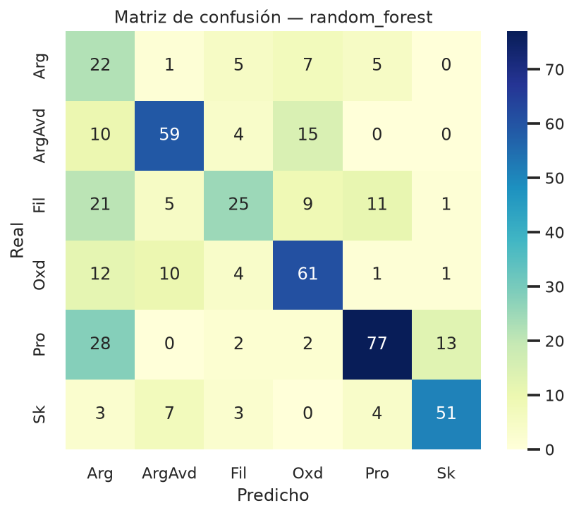
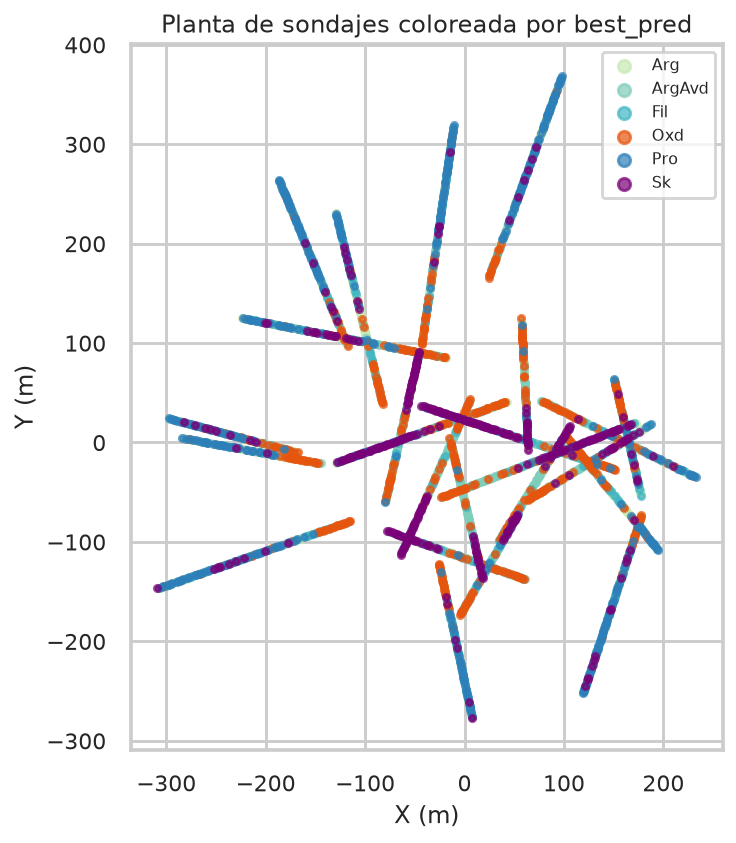

# Capítulo V. Resultados de machine learning

!!! success "Resultado que debes recordar"
    **Random Forest** es el clasificador elegido. SVM queda último. Hay *dos*
    tablas: la de la tesis (Orange, dato real) y la de este repositorio
    (scikit-learn, dato sintético). No se mezclan las cifras; sí se reproduce
    el orden.

Hay **dos capas** de cifras. Las de la tesis (Orange, dato real) y las del
repositorio (scikit-learn, dato sintético). No se deben mezclar.

## 5.1 Desempeño en la tesis (dato de calibración)

Entrenamiento sobre 69 231 muestras etiquetadas (Tabla 25, promedios):

| Modelo | AUC | Precisión | Recall |
| --- | --- | --- | --- |
| SVM | 0,585 | 0,340 | 0,285 |
| Random Forest | 0,990 | 0,993 | 0,993 |
| Red neuronal | 0,998 | 0,969 | 0,969 |
| k-NN | 0,999 | 0,981 | 0,981 |

RF, MLP y k-NN superan 96 % de coincidencia en esa partición. SVM queda
muy por debajo: datos no linealmente separables y/o hiperparámetros (C,
gamma, 100 iteraciones) insuficientes (Cortes & Vapnik, 1995).

AUC one-vs-rest por dominio (Figura 43, valores aproximados de la tesis):

| Dominio | RF | MLP | k-NN | SVM |
| --- | --- | --- | --- | --- |
| Arg | 0,98–0,99 | 0,97 | 0,90 | 0,75 |
| ArgAvd | 0,97 | 0,96 | 0,88 | 0,70 |
| Fil | 0,99 | 0,98 | 0,90 | 0,68 |
| Oxd | 0,97 | 0,96 | 0,89 | 0,73 |
| Pro | 0,99 | 0,99 | 0,90 | 0,75 |
| Sk | 0,98 | 0,96 | 0,88 | 0,72 |

En validación más estricta (Tabla 26) RF se mantiene cerca de 1 en AUC y F1
por dominio; SVM cae en Fil y Sk (AUC 0,47 y 0,53 en algunos bloques). Eso
coincide con Rodríguez-Galiano et al. (2015) y con las limitaciones de SVM en
geoquímica compleja (Pour & Hashim, 2014).

## 5.2 Sobreajuste (curvas de aprendizaje)

| Modelo | Train | Validación ciega | Lectura |
| --- | --- | --- | --- |
| Random Forest | ~1,0 | ~0,73–0,78 | Sobreajuste moderado; mejor equilibrio |
| SVM | ~0,91–0,95 | ~0,70–0,73 | Menos techo, más estable |
| MLP | ~0,99 | ~0,55–0,67 | Sobreajuste fuerte |
| k-NN | ~0,99 | ~0,60–0,67 | Sobreajuste fuerte |

RF sigue siendo el elegido: mejor precisión de validación pese al gap
train/test. Parte de la fluctuación viene de Arg y Pro (pocos tramos).

## 5.3 Modelo 3D y vectores

Las predicciones RF se cargaron a Leapfrog. En sección, los contactos RF son
más continuos que el sólido armado solo con logueo visual. La zonación
resultante es un sistema HS con transiciones a pórfido/skarn (Sillitoe, 2010):

- Núcleo argílico avanzado (alunita–pirofilita) en centro-sur/este del modelo.
- Halo fílico (mica blanca).
- Propilítica distal (clorita–carbonato).
- Óxidos y sílice hidratada en superficie.
- Skarn / potásica en profundidad (esta última, ciega a SWIR).

Los dominios se alinean con estructuras NE–SW y NW–SE. Alunita y yeso marcan
conductos de fluidos ácidos. Eso alimenta geometalurgia (argílico vs fílico),
blancos de perforación y dominios de estimación.

## 5.4 Réplica en el sintético de este repo

`python -m alteration_ml.cli run --profile thesis` (semilla 42) reproduce el
**orden** RF > MLP > k-NN > SVM, no los números absolutos (el sintético es
otro universo, con ruido y transiciones programadas).

## 5.5 Limitaciones (sección 4.8)

- Desbalance de clases: pirofilita/alunita bien muestreadas; Arg y Pro no.
- TerraSpec no detecta cuarzo, sulfuros ni feldespato → potásica y sulfuros
  quedan fuera.
- Mezclas de hasta seis minerales enmascaran fases menores (Al–OH / Fe–OH).
- El supervisado hereda errores del etiquetado en Leapfrog.

**Siguiente:** [Conclusiones](05-conclusiones.md), o
[prueba el flujo](09-orange-colab.md) en Orange o Colab.

