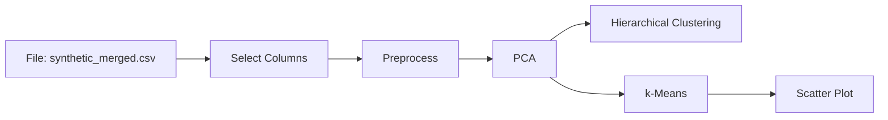
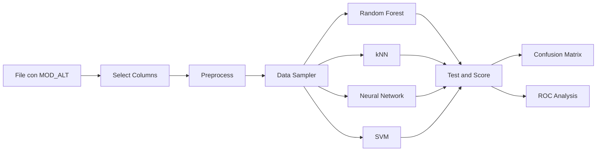

# Orange y Google Colab (sin instalar Python)

Si no programas a diario, **no hace falta una terminal**. La tesis se armó en
**Orange** (lienzo de widgets). Este repo añade **Google Colab** (un cuaderno
en el navegador). El código Python queda para quien quiera automatizar o
llevar el método a otro yacimiento.

| Camino | Qué necesitas | Para quién |
| --- | --- | --- |
| [Orange](#orange-como-en-la-tesis) | Instalar [Orange 3](https://orangedatamining.com/) (Windows/macOS/Linux) | Quien ya usó el flujo de la tesis o prefiere “cajas y flechas” |
| [Google Colab](#google-colab-un-clic) | Cuenta de Google | Quien quiere ver el resultado sin instalar nada |
| [Python local](06-replicacion.md) | `pip` y una consola | Quien va a replicar en sus sondajes o contribuir código |

## Google Colab (un clic)

1. Abre el cuaderno:
   
2. Menú **Entorno de ejecución → Ejecutar todo**.
3. Espera a que instale el paquete y genere las figuras. Al final verás el
   ranking RF / red / k-NN / SVM (el mismo de la tesis, sobre dato sintético).

El cuaderno clona este repositorio, instala dependencias y corre
`alteration_ml` en la nube. No edita tus archivos locales.

!!! tip "Si el botón pide una rama"
    En GitHub: archivo `notebooks/00_colab_pipeline.ipynb` → icono de Colab
    (o “Open in Colab”). Elige la rama del pull request si `main` aún no
    tiene el cuaderno.

## Orange (como en la tesis)

Orange es software libre de la Universidad de Ljubljana. La tesis usó sus
widgets sobre scikit-learn (Figuras 30–32). Aquí se replica el **mismo
lienzo** con el CSV sintético.

### 1. Bajar Orange y el CSV

1. Instala Orange 3: <https://orangedatamining.com/download/>
2. Descarga
   [`synthetic_merged.csv`](https://github.com/jhon21geo/geologia-ML-dominios-alteracion/blob/cursor/metodologia-tesis-sintetica-fd6d/data/synthetic/synthetic_merged.csv)
   (botón Raw → Guardar).

### 2. No supervisado (espectro → clústeres)

En el lienzo, de izquierda a derecha:

**Select Columns (espectro).** Features: los 13 minerales SWIR más Hematite y
Goethite. Ignora `x, y, z, holeid, sample_id` y la geoquímica.

**Preprocess.** Imputar mediana; continuar variables; normalizar (estandarizar).

**PCA.** Componentes suficientes para ver PC1–PC2 (en la tesis se interpretó
el biplot de minerales).

**Hierarchical Clustering.** Distancia euclidiana, enlace Ward, corte en 5
grupos de *minerales* si transpones, o de muestras si no.

**k-Means.** k = 5, inicialización k-means++, semilla fija si el widget lo
permite.

**Scatter Plot.** Ejes PC1 y PC2, color = clúster. Esto es la *propuesta*
del algoritmo, no el dominio.

Luego el geólogo asigna `MOD_ALT` (ver
[Asignación de dominios](03-asignacion-dominios.md)). En Orange puedes
guardar el clúster, exportar a CSV y volver a cargar ya con la columna
`MOD_ALT` firmada.

### 3. Supervisado (geoquímica → MOD_ALT)

**Select Columns.** Target: `MOD_ALT`. Features: columnas químicas (`*_ppm`,
`*_pct`). Ignora coordenadas e IDs.

**Preprocess.** Igual: mediana, continuar, estandarizar (Z-score).

**Data Sampler.** 80 % entrenamiento / 20 % prueba, estratificado por
`MOD_ALT` si el widget lo ofrece.

Hiperparámetros de la tesis (Tablas 19–22):

| Widget | Ajuste publicado |
| --- | --- |
| Random Forest | 10 árboles, 8 atributos, profundidad 4, no partir nodos &lt; 5, clases balanceadas, semilla |
| kNN | k = 5, Euclidean, pesos por distancia |
| Neural Network | 100 neuronas, ReLU, Adam, α = 0,0001, 200 iteraciones |
| SVM | C = 1, kernel RBF, tope 100 iteraciones (en Orange suele quedar flojo) |

**Test and Score** + **Confusion Matrix** + **ROC Analysis** (one vs rest por
dominio). En la tesis, Random Forest ganó; SVM quedó último.

### 4. Predicción de tramos nuevos

**Predictions** (o el widget Predictions) sobre el CSV de química **sin**
etiqueta. Exporta `holeid`, `from_m`, `to_m` y la clase predicha para
Leapfrog u otro modelador 3D.

## Qué no hace Orange ni Colab por ti

El **juicio geológico** al etiquetar dominios. Ni el lienzo ni el cuaderno
sustituyen mirar la continuidad en sección. Ver
[Asignación de dominios](03-asignacion-dominios.md).
