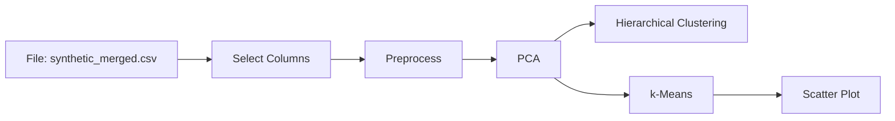
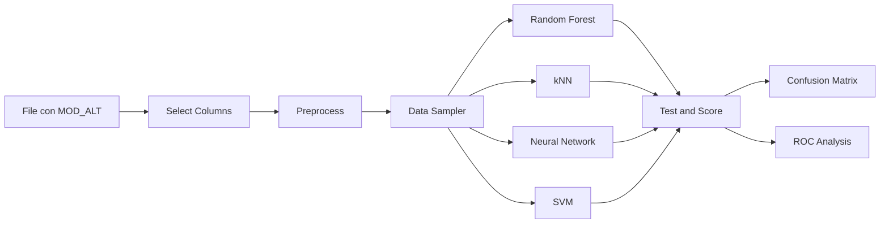

# Orange, Colab y cuadernos

Cuatro caminos para el mismo método. El más avanzado, alineado con lo que ya
corre en producción, es **GeoIA**: PCA, firma de `MOD_ALT`, lienzo tipo Orange
y predicción del 60 % de sondajes ciegos, **en el navegador**.

-   :material-flask: **GeoIA (navegador)**

    ---

    Sin instalar nada. Dataset sintético o tus tablas (collar/assay/espectro).

    [:octicons-arrow-right-24: geoia.site/dominios-ml](https://geoia.site/dominios-ml/)

-   :material-google: **Google Colab**

    ---

    Un clic, cuenta de Google, *Entorno de ejecución → Ejecutar todo*.

    [:octicons-arrow-right-24: Cuaderno 00](#google-colab-un-clic)

-   :material-view-dashboard-variant: **Orange 3**

    ---

    El lienzo original de la tesis (widgets sobre scikit-learn).

    [:octicons-arrow-right-24: Cómo armar el lienzo](#orange-como-en-la-tesis)

-   :material-console: **Python local**

    ---

    Paquete `alteration_ml` y cuadernos 01–03.

    [:octicons-arrow-right-24: Guía de replicación](06-replicacion.md)

| Camino | Qué necesitas | Para quién |
| --- | --- | --- |
| [GeoIA](10-geoia-dominios.md) | Navegador | Quien quiere firmar `MOD_ALT` y ver Test & Score ya |
| [Google Colab](#google-colab-un-clic) | Cuenta de Google | Quien quiere las cifras de `scikit-learn` sin instalar |
| [Orange](#orange-como-en-la-tesis) | [Orange 3](https://orangedatamining.com/) | Quien replica el lienzo de la tesis |
| [Python local](06-replicacion.md) | `pip` y una consola | Quien pega el flujo a sus sondajes |

## Google Colab (un clic)

El cuaderno **00** clona este repositorio (`main`), instala `alteration_ml` y
corre el perfil `thesis` sobre el sintético: PCA, K-Means y los cuatro
clasificadores.

1. Abre:
   
2. Menú **Entorno de ejecución → Ejecutar todo**.
3. Al final aparece el ranking RF / red / k-NN / SVM.

Los otros tres cuadernos profundizan las mismas fases que GeoIA:

| Cuaderno | Fase | Enlace |
| --- | --- | --- |
| `00_colab_pipeline.ipynb` | Todo el flujo | [Colab](https://colab.research.google.com/github/jhon21geo/geologia-ML-dominios-alteracion/blob/main/notebooks/00_colab_pipeline.ipynb) |
| `01_eda_espectral_geoquimica.ipynb` | Logueo / tabla | [GitHub](https://github.com/jhon21geo/geologia-ML-dominios-alteracion/blob/main/notebooks/01_eda_espectral_geoquimica.ipynb) |
| `02_unsupervised_ensambles.ipynb` | Fase 1 (PCA, dendrograma, k = 5) | [GitHub](https://github.com/jhon21geo/geologia-ML-dominios-alteracion/blob/main/notebooks/02_unsupervised_ensambles.ipynb) |
| `03_supervised_clasificacion.ipynb` | Fase 2 (RF, kNN, MLP, SVM) | [GitHub](https://github.com/jhon21geo/geologia-ML-dominios-alteracion/blob/main/notebooks/03_supervised_clasificacion.ipynb) |

En local: clona el repo y ábrelos desde `notebooks/` con Jupyter. Las rutas
relativas a `data/synthetic/` asumen que el kernel arranca en esa carpeta.

## Orange (como en la tesis)

Orange es software libre de la Universidad de Ljubljana. La tesis usó sus
widgets sobre scikit-learn (Figuras 30–32). Aquí se replica el **mismo
lienzo** con el CSV sintético. GeoIA dibuja ese lienzo en la Fase 2; Orange
es la vía que **sí** usa kernel RBF y 100 neuronas / 200 iteraciones.

### 1. Bajar Orange y el CSV

1. Instala Orange 3: <https://orangedatamining.com/download/>
2. Descarga
   [`synthetic_merged.csv`](https://raw.githubusercontent.com/jhon21geo/geologia-ML-dominios-alteracion/main/data/synthetic/synthetic_merged.csv)
   (Guardar como CSV).

### 2. No supervisado (espectro → clústeres)

En el lienzo, de izquierda a derecha:

```mermaid
flowchart LR
  A[File: synthetic_merged.csv] --> B[Select Columns]
  B --> C[Preprocess]
  C --> D[PCA]
  D --> E[Hierarchical Clustering]
  D --> F[k-Means]
  F --> G[Scatter Plot]
```

**Select Columns (espectro).** Features: los **13 minerales SWIR** más
**Hematite** y **Goethite** (15 columnas; las mismas de GeoIA). Ignora
`x, y, z, holeid, sample_id` y la geoquímica.

**Preprocess.** Imputar mediana; continuar variables; normalizar (estandarizar).

**PCA.** Componentes suficientes para ver PC1–PC2 (en la tesis se interpretó
el biplot de minerales; en GeoIA puedes cambiar PC1–PC4).

**Hierarchical Clustering.** Distancia euclidiana, enlace Ward, corte en 5
grupos de *minerales* si transpones, o de muestras si no. GeoIA usa enlace
promedio sobre las 15 variables.

**k-Means.** k = 5, inicialización k-means++, semilla fija si el widget lo
permite.

**Scatter Plot.** Ejes PC1 y PC2, color = clúster. Esto es la *propuesta*
del algoritmo, no el dominio.

Luego el geólogo asigna `MOD_ALT` (ver
[Asignación de dominios](03-asignacion-dominios.md)). En GeoIA lo haces con un
polígono sobre collares logueados. En Orange puedes guardar el clúster,
exportar a CSV y volver a cargar ya con la columna `MOD_ALT` firmada.

### 3. Supervisado (geoquímica → MOD_ALT)

```mermaid
flowchart LR
  A[File con MOD_ALT] --> B[Select Columns]
  B --> C[Preprocess]
  C --> D[Data Sampler]
  D --> E[Random Forest]
  D --> F[kNN]
  D --> G[Neural Network]
  D --> H[SVM]
  E --> I[Test and Score]
  F --> I
  G --> I
  H --> I
  I --> J[Confusion Matrix]
  I --> K[ROC Analysis]
```

**Select Columns.** Target: `MOD_ALT`. Features: columnas químicas (`*_ppm`,
`*_pct`). Ignora coordenadas e IDs.

**Preprocess.** Igual: mediana, continuar, estandarizar (Z-score).

**Data Sampler.** En la tesis: 80 % entrenamiento / 20 % prueba, estratificado
por `MOD_ALT`. En GeoIA la reserva es **por collar** (40 % logueados / 60 %
ciegos).

Hiperparámetros de la tesis (Tablas 19–22):

| Widget | Ajuste publicado |
| --- | --- |
| Random Forest | 10 árboles, 8 atributos, profundidad 4, no partir nodos &lt; 5, clases balanceadas, semilla |
| kNN | k = 5, Euclidean, pesos por distancia |
| Neural Network | 100 neuronas, ReLU, Adam, α = 0,0001, 200 iteraciones |
| SVM | C = 1, kernel RBF, tope 100 iteraciones (en Orange suele quedar flojo) |

**Test and Score** + **Confusion Matrix** + **ROC Analysis** (one vs rest por
dominio). En la tesis, Random Forest ganó; SVM quedó último.

### 4. Predicción de tramos nuevos

**Predictions** sobre el CSV de química **sin** etiqueta. Exporta `holeid`,
`from_m`, `to_m` y la clase predicha para Leapfrog u otro modelador 3D. En
GeoIA eso es la **Fase 3** (collares no logueados o un CSV propio).

## Qué no hacen GeoIA, Orange ni Colab por ti

El **juicio geológico** al etiquetar dominios. Ni el lienzo, ni el cuaderno,
ni el polígono en el PCA sustituyen mirar la continuidad en sección. Ver
[Asignación de dominios](03-asignacion-dominios.md).
