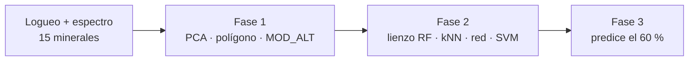

# Réplica en el navegador (GeoIA)

La implementación más avanzada del método está en
**[geoia.site/dominios-ml](https://geoia.site/dominios-ml/)**.
Corre **en tu navegador**: no instala Python, no envía tablas a un servidor y
reproduce el mismo esquema de la tesis —espectro SWIR–VNIR, geoquímica y
alteración de logueo— sobre el CSV sintético de este repositorio.

!!! abstract "Qué hace la página"
    1. Carga el logueo + 15 minerales + ~34 columnas químicas (o tus tablas).
    2. **Fase 1.** PCA / K-Means / dendrograma; eliges tramos y **firmas `MOD_ALT`**.
    3. **Fase 2.** Lienzo tipo Orange: RF, kNN, red y SVM, Test & Score, matriz y ROC.
    4. **Fase 3.** Predice el **60 % de sondajes sin logueo** y exporta CSV.

[**Abrir Dominios ML** — geoia.site/dominios-ml](https://geoia.site/dominios-ml/){: .md-button .md-button--primary }

## Correspondencia con la tesis y con este repo

| En la tesis / este repo | En GeoIA |
| --- | --- |
| 13 scores SWIR + hematita/goethita | 15 variables espectrales (Fase 1) |
| ~34 elementos (completitud ≥ 80 %) | columnas geoquímicas (Fase 2) |
| Geólogo firma `MOD_ALT` en sección | polígono sobre el PCA de collares logueados |
| Orange: File → PCA → k-Means → Test & Score | lienzo de nodos en la pestaña Fase 2 |
| Predicción a tramos ciegos | 60 % de collares reservados + CSV propio |
| Cuadernos `01`–`03` y `alteration_ml` | misma lógica, en scikit-learn / Colab |

El clúster espectral **no** es el dominio. En GeoIA cada clúster *propone*
un `MOD_ALT` (logueo mayoritario); tú lo editas y solo se escribe en las
muestras seleccionadas. Eso es lo mismo que describe
[Asignación de dominios](03-asignacion-dominios.md).

## Cómo recorrerlo (caso de alteración)

1. **Alteración de logueo.** Revisa el 3D / tabla. Por defecto usa el sintético
   de la tesis. Puedes cargar collar + survey + assay + espectral, unir assay y
   espectro por from–to, o un CSV de tramos con XYZ.
   Pulsa **Separar collares 40/60**: 40 % logueados para entrenar; 60 % quedan
   “ciegos”.
2. **Fase 1.** Recalcula PCA. Dibuja un polígono (clic = vértice; doble clic
   cierra; Shift añade otro). Firma `MOD_ALT` en las seleccionadas y continúa.
3. **Fase 2.** Entrena los cuatro modelos. Test & Score compara contra el 60 %
   con logueo oculto. Clic en un nodo del lienzo salta al bloque (matriz, ROC).
4. **Fase 3.** Predice dominios en collares no logueados o en un CSV propio y
   descarga el resultado.

## Qué reproduce y qué simplifica

**Fiel a la tesis**

- Las 15 variables espectrales y las ~34 químicas del
  [`synthetic_merged.csv`](https://raw.githubusercontent.com/jhon21geo/geologia-ML-dominios-alteracion/main/data/synthetic/synthetic_merged.csv).
- PCA + K-Means sobre el espectro; clustering jerárquico (enlace promedio) sobre
  los minerales.
- Los cuatro algoritmos y las métricas Test & Score / confusión / ROC.

**Simplificado a propósito (navegador)**

- SVM lineal (Pegasos); en Orange la tesis usó kernel RBF.
- Red con 30 neuronas / 60 iteraciones (en la tesis: 100 / 200).
- `MOD_ALT` se firma en Fase 1; no llega ya cerrado en los datos de entrada.
- Extensión de la réplica (no es el caso del Resumen): si eliges una columna
  **numérica** (ley, óxido) los mismos cuatro algoritmos corren como
  **regresión** (RMSE, MAE, R²).

Los números exactos no coinciden con Orange ni con `scikit-learn`. El orden
relativo de los modelos suele parecerse. Para cifras reproducibles usa los
[cuadernos](09-orange-colab.md) o el [paquete Python](06-replicacion.md).

## Relación con los cuadernos

| Cuaderno | Qué cubre | Equivalente en GeoIA |
| --- | --- | --- |
| [`00_colab_pipeline.ipynb`](https://colab.research.google.com/github/jhon21geo/geologia-ML-dominios-alteracion/blob/main/notebooks/00_colab_pipeline.ipynb) | Pipeline completo, un clic | Fases 1–3 de un tirón |
| [`01_eda_espectral_geoquimica.ipynb`](https://github.com/jhon21geo/geologia-ML-dominios-alteracion/blob/main/notebooks/01_eda_espectral_geoquimica.ipynb) | Tabla, dominios, ensambles | pestaña de logueo y vista previa |
| [`02_unsupervised_ensambles.ipynb`](https://github.com/jhon21geo/geologia-ML-dominios-alteracion/blob/main/notebooks/02_unsupervised_ensambles.ipynb) | PCA, dendrograma, k = 5 | Fase 1 |
| [`03_supervised_clasificacion.ipynb`](https://github.com/jhon21geo/geologia-ML-dominios-alteracion/blob/main/notebooks/03_supervised_clasificacion.ipynb) | RF / kNN / MLP / SVM | Fase 2 + predicción |

GeoIA es otra implementación (TypeScript en el cliente). Los cuadernos y
`alteration_ml` son la vía que **sí** reproduce los hiperparámetros publicados
(Tablas 19–22).

**Siguiente:** [Orange y Google Colab](09-orange-colab.md) si quieres el lienzo
original o un clic en la nube, o [asignación de dominios](03-asignacion-dominios.md)
para el criterio geológico.

