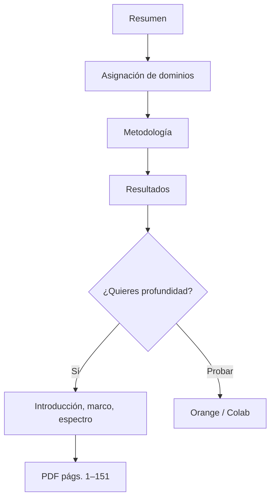

---
hide:
  - toc
---

# Cómo leer este visor

Versión condensada de la tesis para lectura en línea: problema de investigación,
criterio de asignación de dominios y selección del clasificador. El
[PDF (págs. 1–151)](tesis-pdf.md) conserva el texto original.

!!! abstract "Lectura mínima"
    1. [Resumen](00-resumen.md) — formulación y resultados.
    2. [Asignación de dominios](03-asignacion-dominios.md) — clúster espectral frente a `MOD_ALT`.
    3. [Resultados](04-modelamiento-ml.md) — Random Forest frente a SVM, k-NN y MLP.

## Qué página responde a qué

| Si te preguntas… | Ve a |
| --- | --- |
| ¿De qué trata la tesis, en una página? | [Resumen y abstract](00-resumen.md) |
| ¿Por qué hace falta ML en alteración? | [Introducción](00b-introduccion-tesis.md) y [planteamiento](01-introduccion.md) |
| ¿Qué es un sistema HS y qué ve el SWIR? | [Marco teórico](02-marco-teorico.md) |
| ¿Cuáles son las seis etapas del flujo? | [Metodología](02-metodologia.md) |
| ¿El K-Means *es* el dominio? **No.** | [El geólogo asigna los dominios](03-asignacion-dominios.md) |
| ¿Qué minerales y elementos se usaron? | [Espectro y geoquímica](03-analisis-espectral.md) |
| ¿Quién gana: RF, red, k-NN o SVM? | [Resultados de ML](04-modelamiento-ml.md) |
| ¿Qué se concluye y qué se recomienda? | [Conclusiones](05-conclusiones.md) |
| ¿Puedo repetirlo sin programar? | [Orange y Google Colab](09-orange-colab.md) |
| ¿Puedo pegarlo a mis sondajes? | [Replicar en Python](06-replicacion.md) |

## Orden recomendado (no es el de los capítulos)

Los capítulos 1, 2 y 4 (planteamiento, marco, espectro) son **fondo**. Sirven
cuando ya tienes clara la distinción clúster ≠ dominio.

## Tres avisos para no mezclar cifras

1. **Dato de la tesis** (Orange, calibración real) y **dato de este repo**
   (scikit-learn, sintético) no se promedian. El ranking cualitativo sí se
   reproduce: Random Forest primero, SVM último.
2. K-Means usa **k = 5** sobre scores minerales. Los dominios geológicos son
   **seis** (`Arg`, `ArgAvd`, `Fil`, `Oxd`, `Pro`, `Sk`) porque el geólogo
   nombra ensambles, no números de clúster.
3. El visor omite geometría y logística de la unidad. El análogo geológico es
   un epitermal Au–Cu de alta sulfuración con transición a pórfido/skarn.

**Siguiente:** [Resumen y abstract](00-resumen.md) — el argumento de la tesis
en dos idiomas.

