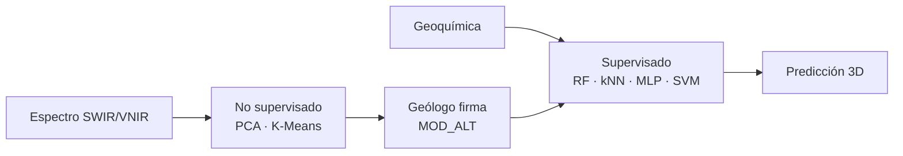

---
hide:
  - toc
---

# Delimitación de dominios de alteración con machine learning

Tesis de pregrado (versión resumida para leer en línea). El método une
**espectro SWIR–VNIR**, **geoquímica de sondaje** y el **juicio del geólogo**
para definir seis dominios de alteración y luego clasificarlos.

Jhonatan Paul Mallma Espinoza · Asesor: MSc. César Augusto Mendoza Tarazona 
Ingeniero Geólogo · FIGMM · Universidad Nacional de Ingeniería · Lima, 2026

**Idea central:** el clustering propone grupos; el geólogo los convierte en
dominios (`MOD_ALT`); **Random Forest** extiende esa firma al resto de la
malla. Los datos de este repositorio son **sintéticos** (mismos ensambles, sin
detalle de la unidad de calibración).

  ArgAvd · argílica avanzada
  Fil · fílica
  Arg · argílica
  Pro · propilítica
  Sk · skarn
  Oxd · óxidos

## Empieza por aquí

El visor no hay que leerlo de cabo a rabo. Elige un camino:

<a href="guia/">
  
1

  <strong>Mapa de lectura</strong>
  Qué página responde a qué pregunta, y en qué orden conviene ir.
</a>
<a href="00-resumen/">
  
2

  <strong>Resumen (2 minutos)</strong>
  Problema, seis dominios y por qué gana Random Forest.
</a>
<a href="03-asignacion-dominios/">
  
3

  <strong>Asignación de dominios</strong>
  La etapa que no se automatiza: algoritmo + criterio geológico.
</a>

-   :material-book-open-page-variant: **Leer la tesis resumida**

    ---

    Capítulos condensados, figuras del flujo y el PDF de 160 páginas en
    solo lectura.

    [:octicons-arrow-right-24: Abrir el visor](guia.md)

-   :material-palette-swatch: **Orange o Google Colab**

    ---

    Para quien no programa: el mismo método en lienzo de widgets o en un
    cuaderno en la nube.

    [:octicons-arrow-right-24: Probar el método](09-orange-colab.md)

-   :material-language-python: **Replicar en Python**

    ---

    Pipeline con dato sintético, tests y plantilla para tus sondajes.

    [:octicons-arrow-right-24: Código local](06-replicacion.md)

## El método en un vistazo

<figure markdown>
  
  <figcaption>Figura guía: el clúster no es el dominio. El geólogo corta, fusiona o descarta intervalos antes de entrenar el clasificador.</figcaption>
</figure>

## Cómo citar

??? note "Formatos IEEE y APA 7"

    **IEEE.** Mallma Espinoza, J., “Delimitación de los dominios geológicos de alteración desde firmas espectrales y geoquímica mediante el empleo de machine learning” [Tesis de pregrado]. Lima, Perú: Universidad Nacional de Ingeniería, 2026.

    **APA 7.** Mallma, J. (2026). *Delimitación de los dominios geológicos de alteración desde firmas espectrales y geoquímica mediante el empleo de machine learning* [Tesis de pregrado, Universidad Nacional de Ingeniería]. Repositorio institucional Cybertesis UNI.

ORCID del autor: [0009-0007-5912-5915](https://orcid.org/0009-0007-5912-5915).
Asesor: [0009-0009-5452-3636](https://orcid.org/0009-0009-5452-3636).

Sitio publicado:
[jhon21geo.github.io/geologia-ML-dominios-alteracion](https://jhon21geo.github.io/geologia-ML-dominios-alteracion/).[^url]

[^url]: La dirección `jhonatanmallma.github.io/...` no corresponde a este repositorio (muestra 404).
