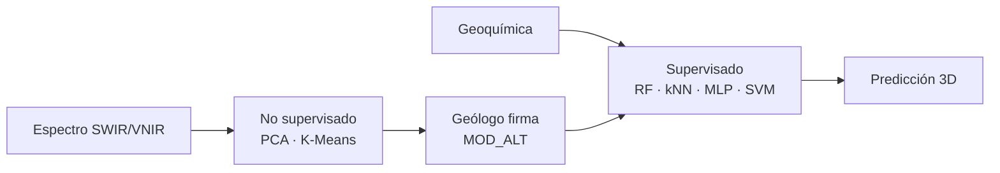
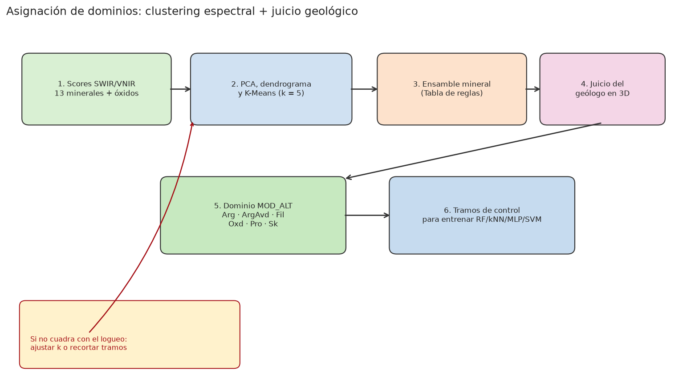

---
hide:
  - toc
---

# Delimitación de dominios geológicos de alteración mediante firmas espectrales, geoquímica y aprendizaje automático

Tesis de pregrado. Flujo cuantitativo para clasificar dominios de alteración
hidrotermal a partir de espectrometría **SWIR–VNIR**, geoquímica de sondaje y
criterio geológico: seis clases mineralógicas y comparación de clasificadores
supervisados.

Jhonatan Paul Mallma Espinoza · Asesor: MSc. César Augusto Mendoza Tarazona 
Ingeniero Geólogo · FIGMM · Universidad Nacional de Ingeniería · Lima, 2026

La hipótesis de trabajo es que el aprendizaje no supervisado (PCA, agrupamiento
jerárquico y K-Means) **propone** agrupaciones espectrales, pero el dominio
geológico (`MOD_ALT`) se define cuando el geólogo valida el ensamble diagnóstico
y la continuidad espacial. El clasificador supervisado —**Random Forest** en
esta investigación— extiende esa firma al resto de la malla. El repositorio
reproduce el flujo con **datos sintéticos** de los mismos ensambles, sin
geometría de la unidad de calibración.

  ArgAvd · argílica avanzada
  Fil · fílica
  Arg · argílica
  Pro · propilítica
  Sk · skarn
  Oxd · óxidos

## Recorrido de lectura

El visor condensa la tesis. No es necesario seguir el orden capitular:

[**1 · Mapa de lectura**
Correspondencia entre preguntas de investigación y secciones del visor.](guia.md)

[**2 · Resumen y abstract**
Problema, seis dominios y desempeño relativo de los clasificadores.](00-resumen.md)

[**3 · Asignación de dominios**
Etapa crítica: clustering espectral y corte geológico de `MOD_ALT`.](03-asignacion-dominios.md)

[**4 · Replicación experimental**
Orange, Google Colab o pipeline en Python sobre el conjunto sintético.](09-orange-colab.md)

-   :material-book-open-page-variant: **Tesis resumida**

    ---

    Capítulos condensados, figuras del flujo y el PDF (páginas 1–151).

    [:octicons-arrow-right-24: Abrir el visor](guia.md)

-   :material-palette-swatch: **Orange o Google Colab**

    ---

    Reproducción del experimento sin entorno Python local (lienzo de widgets o cuaderno en la nube).

    [:octicons-arrow-right-24: Protocolo experimental](09-orange-colab.md)

-   :material-language-python: **Implementación en Python**

    ---

    Paquete `alteration_ml`, datos sintéticos, pruebas automáticas y plantilla para sondajes propios.

    [:octicons-arrow-right-24: Replicar el pipeline](06-replicacion.md)

## Esquema metodológico

<figure markdown>
  
  <figcaption>Figura 1. El clúster espectral no equivale al dominio geológico. El geólogo recorta, fusiona o descarta intervalos antes del entrenamiento supervisado.</figcaption>
</figure>

## Cómo citar

??? note "Formatos IEEE y APA 7"

    **IEEE.** Mallma Espinoza, J., “Delimitación de los dominios geológicos de alteración desde firmas espectrales y geoquímica mediante el empleo de machine learning” [Tesis de pregrado]. Lima, Perú: Universidad Nacional de Ingeniería, 2026.

    **APA 7.** Mallma, J. (2026). *Delimitación de los dominios geológicos de alteración desde firmas espectrales y geoquímica mediante el empleo de machine learning* [Tesis de pregrado, Universidad Nacional de Ingeniería]. Repositorio institucional Cybertesis UNI.

ORCID del autor: [0009-0007-5912-5915](https://orcid.org/0009-0007-5912-5915) ·
Asesor: [0009-0009-5452-3636](https://orcid.org/0009-0009-5452-3636).

## Filiación y contacto

<a href="https://www.uni.edu.pe/"> Universidad Nacional de Ingeniería</a>
<a href="mailto:jhonatangeo21@gmail.com"> jhonatangeo21@gmail.com</a>
<a href="https://www.linkedin.com/in/geomin"> linkedin.com/in/geomin</a>

Sitio publicado:
[jhon21geo.github.io/geologia-ML-dominios-alteracion](https://jhon21geo.github.io/geologia-ML-dominios-alteracion/).[^url]

[^url]: La dirección `jhonatanmallma.github.io/...` no corresponde a este repositorio (muestra 404).
