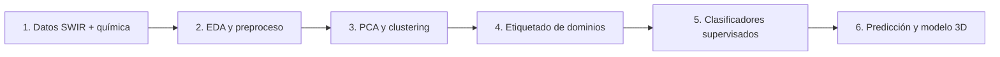
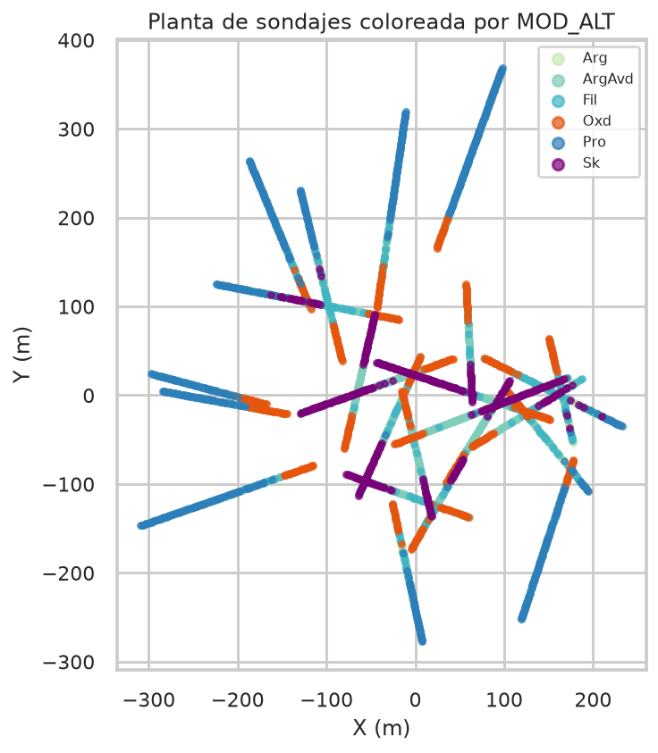

# Metodología abierta de dominios de alteración

Este sitio documenta un pipeline reproducible que une **firmas espectrales
SWIR/VNIR** y **geoquímica de sondaje** para delimitar dominios de alteración
hidrotermal con machine learning.

El trabajo académico de origen es la tesis de pregrado de **Jhonatan Paul
Mallma Espinoza** (FIGMM, Universidad Nacional de Ingeniería, 2026), asesorada
por MSc. César Augusto Mendoza Tarazona. El repositorio **no reproduce la
unidad minera ni las coordenadas reales**: usa un yacimiento sintético con las
mismas asociaciones mineralógicas, el mismo desbalance de clases y los mismos
algoritmos.

!!! tip "Ejecutar en cinco minutos"
    `pip install -e .` y luego `python -m alteration_ml.cli run --profile thesis`.
    Las figuras de esta documentación se generan con esa orden.

## Flujo en seis etapas

1. **Datos.** Scores minerales tipo Ausspec y ensayos multielementales.
2. **Preproceso.** Completitud ≥ 80 %, imputación por sondaje, recorte p99, Z-score.
3. **No supervisado.** PCA, dendrograma de minerales y K-Means con `k=5`.
4. **Segmentación.** Seis dominios: Arg, ArgAvd, Fil, Oxd, Pro, Sk.
5. **Supervisado.** Random Forest, k-NN, MLP y SVM sobre geoquímica.
6. **Exportación.** Intervalos predichos para modelamiento implícito.

## Resultado que debe verse

En un sistema epitermal de alta sulfuración con transiciones a pórfido/skarn
se espera un núcleo ácido (pirofilita–alunita), un halo fílico de micas blancas,
argílica intermedia, propilítica distal, skarn profundo y un sombrero de óxidos.

## Cómo opinar o replicar

El repositorio está preparado para terceros:

- Issues de [opinión metodológica](https://github.com/jhon21geo/geologia-ML-dominios-alteracion/issues/new?template=opinion.yml)
- Issues de [replicación](https://github.com/jhon21geo/geologia-ML-dominios-alteracion/issues/new?template=replicacion.yml)
- Guía en [Opiniones y contribuciones](07-contribuciones.md)

## Tesis original

El PDF completo permanece en el repositorio como referencia
([`Tesis.pdf`](Tesis.pdf)). La documentación web se concentra en el método
transferible, no en el detalle de la unidad de estudio.
